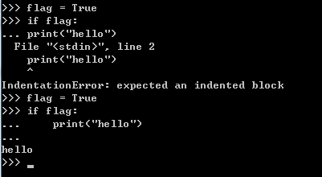

# python-note

python -V 查看python版本（ps:VVV 大写）
<br />
按照教程在python命令窗口输入多行指令
<br />
主提示符是``>>>``，提示输入下一条指令；连续输入行的时候，会显示次要提示符，默认是``...``。
<br />
```
>>> flag = True
>>> if flag:
...		print("hello")
```
<br />
结果报``` File "(stdin)",line 2 ```的错误，提示```print("hello")```这句有错误
<br />
原来是没有跳格，错误、正确输入如下图：
<br />
<br />

<br />

